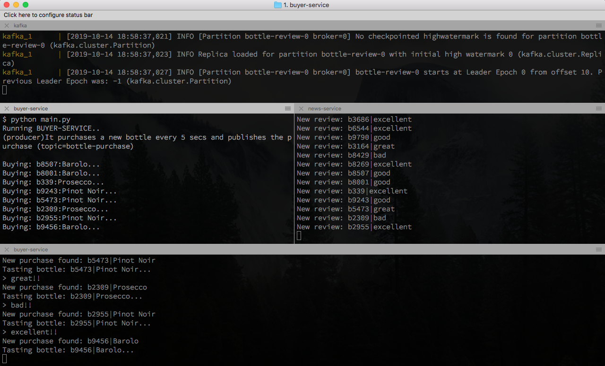

Kafka Event Sourcing Python POC
===============================
This project is a proof-of-concept of an **event sourcing** system with **Kafka** and **Python**.

The project handles wine bottles 🍾 and their tasting review. It is composed of 3 services:
- `buyer-service`: it purchases a new bottle every 5 seconds and it produces the new
purchase event to the channel `bottle-purchase`.
- `taster-service`: it waits for a new purchase by consuming from the channel `bottle-purchase`,
then it tastes the wine and produces a review event to the channel `bottle-review`.
- `news-service`: it waits for a new review by consuming from the channel `bottle-review`
and print it.

## Kafka
Kafka is run in a couple of Docker container managed with `docker-compose`.
In order to run it with Docker on Mac:
```bash
$ export DOCKERHOST=$(ifconfig | grep -E "([0-9]{1,3}\.){3}[0-9]{1,3}" | grep -v 127.0.0.1 | awk '{ print $2 }' | cut -f2 -d: | head -n1)
$ docker-compose up
```
See: https://github.com/wurstmeister/kafka-docker/issues/17#issuecomment-370237590

### Basic Kafka admin commands
Connect to a (Docker) kafka cli:
```bash
$ docker exec -ti kafka_kafka_1 bash
```

All the following command are meant to be run in a (Docker) kafka cli:
```bash
# List topics:
$ kafka-topics.sh --bootstrap-server :9092 --list

# Create a topic:
$ kafka-topics.sh --bootstrap-server :9092 --create --topic t1 --replication-factor 1 --partitions 1
# Describe a topic:
$ kafka-topics.sh --bootstrap-server :9092 --describe --topic t1

# Connect with the Kafka (interactive) console CONSUMER:
$ kafka-console-consumer.sh --bootstrap-server :9092 --topic t1
# add `--from-beginning` to consume also old messages.
# Connect with the Kafka (interactive) console PRODUCER:
$ kafka-console-producer.sh --broker-list :9092 --topic t1 --property "parse.key=true" --property "key.separator=:"
> b1:Prosecco 1990
```

## Services
Install the requirements:
```bash
$ pip install -r requirements.txt
```
Then run the services in 3 different consoles:
```bash
$ cd taster-service
$ python main.py

$ cd news-service
$ python main.py

$ cd buyer-service
$ python main.py
```

Expect an output like:
